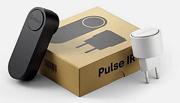
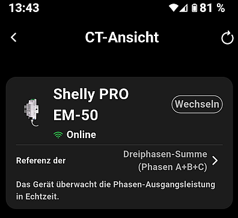
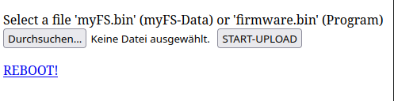
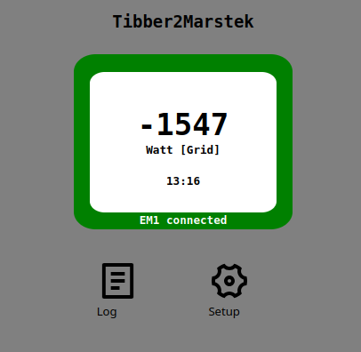
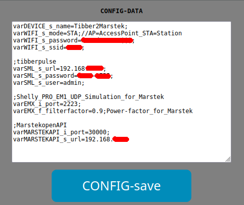
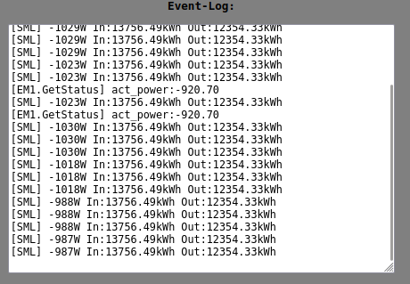
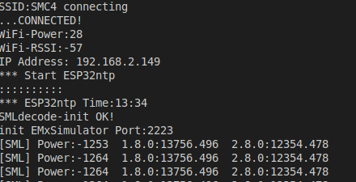

# 'Tibber-Pulse-Bridge' --> 'Marstek-Venus' 

Use your 'Tibber-Pulse-Bridge' Adapter in 'self-consumption mode' for 'MARSTEK-Venus' energy storage system.

 **<-->** 

This solution is running on a ESP8255, ESP32, ESP32-S2 or -S3 Microcontroller. 
* You need no additional hardware ...without any soldering.
* You need not a Tibber contract...but works with contract ! (only the Tiber-Pulse-Bridge Hardware)

**based on the great work of:**
TheRealMoeder (Implementation for ESP): https://github.com/TheRealMoeder/Energy2Shelly_ESP
Kudos to @sdeigms excellent work at https://github.com/sdeigm/uni-meter which made this port easily possible.


### How it works
* the ESP polls per HTTP to the Tibber-Bridge, reads the raw SML-Message and encode the data
* Marstek polls per UDP a 'EM1.GetStatus' message
* the data ist send as simulation of a **Shelly PRO EM1-50** energy meter over UDP

This is a minimal implementation to communicate with the MARSTEK System over UDP Port 2223.
It is (until now) not a full implementaton of all Shelly RPC protocols: only 'EM1.GetStatus'...NO HTTP, NO Webservice, No MQTT.
(look at  https://github.com/Raibisch/Energy2Shelly_ESP for a full implementation..but with no Web-App pages)

### Prepare Tibber-Adapter !
[hacking Tibber-Pulse](doc/tibber_hack.md)


### Program Setup in Platform-IO

* clone reposity and compile in VS-Code Platform-IO (sorry until now no compiled versions)
* in platformio.ino select a platform definition for **one** ESP-Board
```
[platformio]
#default_envs  = lolin-s2-mini
#default_envs = esp32-s3-zero
default_envs = esp32
#default_envs = m5-coreink
#default_envs = heltec_wifi_kit_8
```
optional build flags (optional: DEBUG_PRINT, MARSTEK_API is in early beta version):
```
build_flags =
    -DDEBUG_PRINT=1
    -DWEB_APP=1
    -DSML_TIBBER=1
    -DEM1_UDP_SIMULATION=1
    #-DMARSTEK_API=1 
````
### Program Data Configuration
- in the 'data' folder copy 'config_template.txt' to 'config.txt'
- edit the config.txt with Wifi and Tibber-Pulse credentials 
important syntax rules:
    * no quotation marks for Strings
    * ';' at end of every line with variables
    * comments after ';'possible

````
arDEVICE_s_name=Tibber2Marstek;
varWIFI_s_mode=STA;//AP=AccessPointSTA=Station
varWIFI_s_password=xxxxxxx;
varWIFI_s_ssid=XXXXX;

;tibberpulse
varSML_s_url=192.168.x.xx;
varSML_s_password=XXXX-XXXX;
varSML_s_user=admin;

;Shelly EM1 UDP Simulation for Marstek
varEMX_i_port=2223;  
varEMX_f_filterfactor=1.0;  Power-factor for Mastek 

;Marstek open API
varMARSTEKAPI_i_port=30000;
varMARSTEKAPI_s_url =192.168.x.xx;
````

- upload program **and* data (PROJECT TASK  --> <Platform e.g. ESP32>) --> Build Filesystem Image --> Upload Filesystem Image
- optional: only upload program and later do OTA Updata of SPIFFS-Data on Web upload page.

### Setup ESP Web-App

##### First-Time-Start with no or unvalid WIFI-credentials: 

* look at WiFi-Connections for AP 'TibberPulse2Marstek'
* open the Web-APP with 'http:192.168.4.1/ota_ap.html
* there is minimal Webpage for uploading data
> 
* select from 'upload/spiffs.bin' for myFS.bin
* REBOOT

##### Start with data pages and valid WIFI-credentials
* open "http:your-ip-addr/" for default page.

* no UDP connection: **! no EM1 request !** (or at first startup before Marstek setup)
* UDP connection ok: **EM1 connected** (Marstek polls per UDP)

<hr>

* go to "Setup" --> "Config-Data" and edit the init data.



### MARSTEK Setup
* On MARSTEK App "CT-change" select "Shelly PRO EM-50" as energy meter. (MASTEK and ESP in same Network!)...starts with Testmode searching for CT-Device(1-2min).

* at the Web-App you see the message: **'EM1 connected'** if the MARSTEK polls over UDP
* MARSTEK APP shows "CT" highlighted and on "CT-Page" "Online" (sometimes needs a down-scroll to update the value)


####  "Log" additions Information and Error Messages 


#### Serial Log-console (115200Bd) with compile switch (in 'platformio.ini) 'DEBUG_PRINT=1'


<hr>

### Additional Docs
[Tasmota and SML-protocol](doc/sml_tasmota.md)

[hacking Tibber-Pulse](doc/tibber_hack.md)

[MARSTEK open-API](doc/MarstekDeviceOpenApi.pdf)


...not testet for other MARSTEK systems...but could work ;-)
