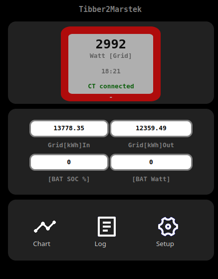

# Energy meter simulation for 'Tibber-Pulse' to 'Marstek'

#### Use your **'Tibber-Pulse-Bridge'** Adapter as energy meter simulation for 'self-consumption' mode of **'MARSTEK'** energy storage systems 


Tibber <-HTTP-connection-> Tibber2Marstek

Tibber2Marstek <-UDP-connection--> MARSTEK


### *NEW:* implementation of 'MARSTEK local API'
The MARSTEK API-implementation is beta, because Marstek has still a bug in there implementation --> after some hours we get no responce from the MARSTEK device (testet with VENUS-E V3 Firmware V139). Until now the app reads the Bat-SOC (state of charge) and actual Bat-Power.
 ...but this bug is not related to the base function 'Shelly Emulation'.

This solution is running on a ESP8255, ESP32, ESP32-S2 or -S3 Microcontroller. 
* You need no additional hardware interface  ... works without any external adapter.
* You need not a Tibber contract...but works with contract ! (only the Tiber-Pulse-Bridge Hardware)

#### based on the work of:
* TheRealMoeder (implementation for ESP): https://github.com/TheRealMoeder/Energy2Shelly_ESP
* Kudos to @sdeigms: https://github.com/sdeigm/uni-meter 
* and many others


### How it works
* the ESP polls per HTTP to the Tibber-Bridge, reads the raw SML-Message and encode the data
* Marstek polls per UDP a 'EM1.GetStatus' message
* the data ist send as simulation of a **Shelly PRO EM1-50** energy meter over UDP

This is a minimal implementation to communicate with the MARSTEK System over UDP Port 2223.
It is (until now) not a full implementaton of all Shelly RPC protocols: only 'EM1.GetStatus'...NO HTTP, NO Webservice, No MQTT.
(look at  https://github.com/Raibisch/Energy2Shelly_ESP for a full implementation..but with no Web-App pages)

there is a CSV based remote procedure call response for for data access on own applications (e.g. homeautomation like home-assistant)
``` http:your-ip/fetch  ```  response:  ```12:55,-444,1111.0,2222.0,0,33,444``` (time,grid_power,grid_kwh_in,grid_kwh_out,responseWatchdog,bat_soc,bat_power)
 ...could be expanded to JSON for future versions (give me a response if you need this).

#### Remark for the program implementation:
The program is based on the libs 'SMLDecode' and 'EMxSimulator' these could be used stand-alone for own implementations. for the Web-App I use some additional libs from my "AsyncWeb" framework (in 'lib' folder). These Web-App Framework is used for my other projects and needs a 'data' folder for storing the Web-pages and the config-File.
 ...why using SPIFFS and not LITTLEFS: SPIFFS has still a smaller code footprint an for my application no backdraw (but could be changed in future)
 ...to compilicated: use  'SMLDecode' and 'EMxSimulator' for your own implementation (I will add an minimal console based example in the 'example' folder)
 ...no ESP: try to compile to your platform

#### Todo (possible Extentions)
* MARSTEK open API (alpha Version is included in '/lib/MastekAPI' for first testing)
* other data sources ans shelly emulations (TASTMOTA, P1, ...see:  https://github.com/Raibisch/Energy2Shelly_ESP)
* JSON HTTP response for Homeautomation systems (now: use CSV based fetch)
* Ethernet ?
* ..?

### Prepare Tibber-Adapter !
[hacking Tibber-Pulse](doc/tibber_hack.md)

### Program Setup in Platform-IO

* clone reposity and compile in VS-Code Platform-IO (sorry until now no compiled versions)
* in platformio.ino select a platform definition for **one** ESP-Board
```
[platformio]
#default_envs  = lolin-s2-mini
#default_envs = esp32-s3-zero
default_envs = esp32
#default_envs = m5-coreink
#default_envs = heltec_wifi_kit_8
```
optional build flags (optional: DEBUG_PRINT, MARSTEK_API is in early beta version):
```
build_flags =
    -DDEBUG_PRINT=1
    -DWEB_APP=1
    -DSML_TIBBER=1
    -DEM1_UDP_SIMULATION=1
    #-DMARSTEK_API=1 
````
### Program Data Configuration
- in the 'data' folder copy 'config_template.txt' to 'config.txt'
- edit the config.txt with Wifi and Tibber-Pulse credentials 
important syntax rules:
    * no quotation marks for Strings
    * ';' at end of every line with variables
    * comments after ';'possible

````
arDEVICE_s_name=Tibber2Marstek;
varWIFI_s_mode=STA;//AP=AccessPointSTA=Station
varWIFI_s_password=xxxxxxx;
varWIFI_s_ssid=XXXXX;

;tibberpulse
varSML_s_url=192.168.x.xx;
varSML_s_password=XXXX-XXXX;
varSML_s_user=admin;

;Shelly EM1 UDP Simulation for Marstek
varEMX_i_port=2223;  
varEMX_f_filterfactor=1.0;  Power_factor_for_small_power_values 

;Marstek open API
varMARSTEKAPI_i_port=30000;
varMARSTEKAPI_s_url =192.168.x.xx;
````

- upload program **and** data (PROJECT TASK  --> <Platform e.g. ESP32>) --> Build Filesystem Image --> Upload Filesystem Image
- optional: only upload program and later do OTA Updata of SPIFFS-Data on Web upload page (ota_ap.html)

### Setup ESP Web-App

##### First-Time-Start with no or unvalid WIFI-credentials: 

* look at WiFi-Connections for AP 'TibberPulse2Marstek'
* open the Web-APP with 'http:192.168.4.1/ota_ap.html
* there is minimal Webpage for uploading data

> 

* select from 'upload/spiffs.bin' for myFS.bin
* REBOOT

##### Start with data pages and valid WIFI-credentials
* open "http:your-ip-addr/" for default page.


* no UDP connection: **'! no MASTEK request !'** (or at first startup before Marstek setup) --> **ESP-LED=ON**
* UDP connection ok: **'connected'** (Marstek polls per UDP) --> **ESP-LED=blinking**


* go to "Setup" --> "Config-Data" and edit the init data.


#### Setup Wifi
varWIFI_s_mode=STA;//AP=AccessPointSTA=Station
varWIFI_s_password=xxxxxxx;
varWIFI_s_ssid=XXXXX;


#### Setup Tibber-Pulse
varSML_s_url=192.168.x.xx;
varSML_s_password=XXXX-XXXX;
varSML_s_user=admin;

#### Setup Marstek
varEMX_i_port=2223;  
varEMX_f_filterfactor=1.0;  Power_factor_for_small_power_values 

#### Setup Marstek-open-API (early alpha)
varMARSTEKAPI_i_port=30000;
varMARSTEKAPI_s_url =192.168.x.xx;

### Setup in MARSTEK App
* "CT-change" select "Shelly PRO EM-50" as energy meter. (MASTEK and ESP in same Network!)...starts with Testmode searching for CT-Device(1-2min).

* at the Web-App you see the message: **'connected'** if the MARSTEK polls over UDP
* MARSTEK APP shows "CT" highlighted and on "CT-Page" "Online" (sometimes needs a down-scroll to update the value)


####  "Log" additions Information and Error Messages 


#### Serial Log-console (115200Bd) with compile switch (in 'platformio.ini) 'DEBUG_PRINT=1'


<hr>

### Additional Docs
[Tasmota and SML-protocol](doc/sml_tasmota.md)

[hacking Tibber-Pulse](doc/tibber_hack.md)

[MARSTEK open-API](doc/MarstekDeviceOpenApi.pdf)

<hr>

...not testet for other MARSTEK systems...but could work ;-)
